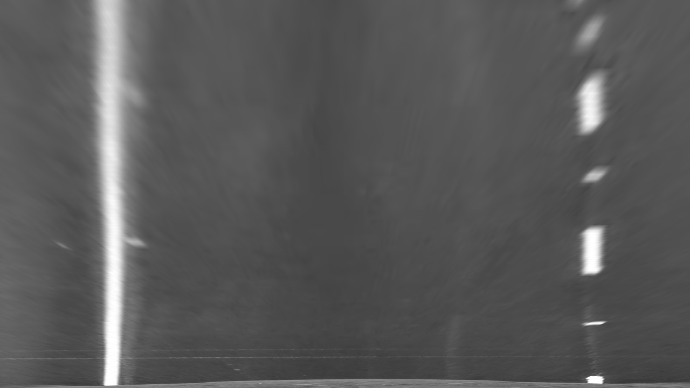

**Advanced Lane Finding Project**

The goals / steps of this project are the following:

* Compute the camera calibration matrix and distortion coefficients given a set of chessboard images.
* Apply a distortion correction to raw images.
* Use color transforms, gradients, etc., to create a thresholded binary image.
* Apply a perspective transform to rectify binary image ("birds-eye view").
* Detect lane pixels and fit to find the lane boundary.
* Determine the curvature of the lane and vehicle position with respect to center.
* Warp the detected lane boundaries back onto the original image.
* Output visual display of the lane boundaries and numerical estimation of lane curvature and vehicle position.

[//]: # "Image References"

[image1]: ./docu_images/undist_straight_lines1.jpg "Undistorted"
[image2]: ./docu_images/warped_straight_lines1.jpg "Warp Example"
[image3]: ./docu_images/red_straight_lines.jpg "Red color component"
[image4]: ./docu_images/sobelbin_straight_lines1.jpg "Binary Example"
[image5]: ./docu_images/result_straight_lines1.jpg "Output"
[video1]: ./output_images/project_video.mp4 "Video"

## [Rubric](https://review.udacity.com/#!/rubrics/571/view) Points

### Here I will consider the rubric points individually and describe how I addressed each point in my implementation.

---

### Writeup / README

#### 1. Provide a Writeup / README that includes all the rubric points and how you addressed each one.  You can submit your writeup as markdown or pdf.  [Here](https://github.com/udacity/CarND-Advanced-Lane-Lines/blob/master/writeup_template.md) is a template writeup for this project you can use as a guide and a starting point.

You're reading it!

### Preliminary remarks

There two Python scripts in this folder. The file alf.py contains the pipeline to process videos. The Jupyter notebook Advanced_Lane_finding.ipynb contains the  pipeline to process images. It loads alf.py as a module, uses some of the functions in alf.py and shows some of the intermediate results.

### Camera Calibration

#### 1. Briefly state how you computed the camera matrix and distortion coefficients. Provide an example of a distortion corrected calibration image.

The code for this step is contained in file alf.py function calcCalibrationMatrix.

I start by preparing "object points", which will be the (x, y, z) coordinates of the chessboard corners in the world. Here I am assuming the chessboard is fixed on the (x, y) plane at z=0, such that the object points are the same for each calibration image.  Thus, `objpoints` is just a replicated array of coordinates, and `objpTemp` will be appended with a copy of it every time I successfully detect all chessboard corners in a test image.  `imgpoints` will be appended with the (x, y) pixel position of each of the corners in the image plane with each successful chessboard detection.

I then used the output `objpoints` and `imgpoints` to compute the camera calibration and distortion coefficients using the `cv2.calibrateCamera()` function and return the camera matrix and the distortion coefficients. Both return values will be stored in function getCameraCalibrationMatrix and will be returned to the caller. If getCameraCalibrationMatrix is called a second time it will load the camera matrix and the distrotion coefficients from file unless it is forced to re-calculate them by parameter `forceCalculation`.

 I applied this distortion correction to the test image using the `cv2.undistort()` function and obtained this result:

![alt text][image1]

### Pipeline (single images)

#### 1. Provide an example of a distortion-corrected image.

To demonstrate this step, I will describe how I apply the distortion correction to one of the test images like this one:


After undistorting the image it looks like this:


#### 2. Describe how (and identify where in your code) you performed a perspective transform and provide an example of a transformed image.

The code for my perspective transform appears in lines 227 through 234 in the file `alf.py`  or, for example, in the 3rd code cell of the IPython notebook `Advanced_line_finding.ipynb`.  

I chose to hardcode the source and destination points in the following manner:

```python
WARP_Y          = 453
WARP_X_BOTTOM   = 150
WARP_X_TOP_LEFT = 586
h, w = imgUndist.shape[:2]
warpXTopRight = w-WARP_X_TOP_LEFT

srcRect = (
  (WARP_X_BOTTOM,h), 
  (w-WARP_X_BOTTOM,h), 
  (warpXTopRight, WARP_Y), 
  (WARP_X_TOP_LEFT, WARP_Y))
dstRect = (
  (WARP_X_BOTTOM,h), 
  (w-WARP_X_BOTTOM,h), 
  (w-WARP_X_BOTTOM, 0), 
  (WARP_X_BOTTOM, 0))
```

This resulted in the following source and destination points:

|  Source   | Destination |
| :-------: | :---------: |
| 586, 453  |   150, 0    |
| 150, 720  |  150, 720   |
| 1130, 720 |  1130, 720  |
| 694, 453  |   1130, 0   |

I verified that my perspective transform was working as expected by drawing the `srcRect` and `dstRect` points onto a test image and its warped counterpart to verify that the lines appear parallel in the warped image.


#### 3. Describe how (and identify where in your code) you used color transforms, gradients or other methods to create a thresholded binary image.  Provide an example of a binary image result.

I use only the read plane of the transformed image to generate a binary image (refer to alf.py line 237). The red plane is sufficient because the lane lines are white and yellow and both colors have a great red color component.



The next step is to remove the dark parts of the image by setting their pixel value to the mean pixel value of the image plus 30%. This will reduce the unwanted disturbances when applying the Sobel operator (`alf.px` lines 240 and 241, respectivly cell 4 in the IPython notebook `Advanced_Line_Finding.ipynb`).

The next step in the pipeline is the detection of vertical lines. At first the derivative of the image in horizontal direction is calculate by applying the Soble operator. Then the resulting image is scaled to an unsigned 8-bit value. All pixel with a value greater than 10 will be set to 1 in the binary image, the other pixels will be set to 0 (refer to `alf.px` lines 244 through 247, respectivly cell 5 in the IPython notebook `Advanced_Line_Finding.ipynb`).


#### 4. Describe how (and identify where in your code) you identified lane-line pixels and fit their positions with a polynomial?

The histogram of the lower part of the image is calculated and smoothed. The detection of the lane lines starts at the position of the two greatest peaks in the histogram. Then I identified the pixels of the  two lane lines starting from the base positions and fit the lane lines with a 2nd order polynomial kinda like in the image below (refer to `alf.py`lines 98 through 151 and 249 through 253 respectivly cell 6 and 7 in `Advanced_Lane_Finding.ipynb`):

![alt text][image5]

#### 5. Describe how (and identify where in your code) you calculated the radius of curvature of the lane and the position of the vehicle with respect to center.

I scaled the lane line pixel positions to the road dimensions and used a 2nd order polynomial fit to calculate the radius of the two lane lines. The lane line having more pixel positions will be treated as the radius of the curvature. 

I did this in lines 255 through 266 in my code in `alf.py` respectively in cell 8 in the IPython notebook.

#### 6. Provide an example image of your result plotted back down onto the road such that the lane area is identified clearly.

I implemented this step in lines 290 through 301 in my code in `alf.py` respectivly in cell 9 of the IPython notebook.  Here is an example of my result on a test image:


---

### Pipeline (video)

#### 1. Provide a link to your final video output.  Your pipeline should perform reasonably well on the entire project video (wobbly lines are ok but no catastrophic failures that would cause the car to drive off the road!).

Here's a [link to my video result](./output_images/project_video.mp4)

---

### Discussion

#### 1. Briefly discuss any problems / issues you faced in your implementation of this project.  Where will your pipeline likely fail?  What could you do to make it more robust?

My pipeline works well for the project video. It fails for somw sequences in the challenge video where the car underpasses bridges and some parts of the image are bright and others are dark. My pipeline could be improved by e. g. using weighted means of the polynomial parameters. 

Another improvement could be to used the found lane position as base position for the lane line search in the next video frame. This would make the line finding more robust and reduce the required processing power.

A third improvement could be to check the line parameters of the left and the right line vice versa. The are in parallel in the bird-eyes view.

A forth improvement could be to check the distance between the found lines is what we expect.

